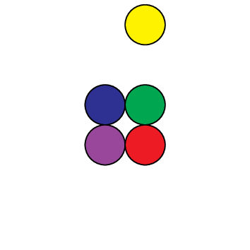

# Quatrefoil
Quatrefoil is a cooperative puzzle game for four players that can be played in 5-10 minutes. It is suitable for all ages, but is intended for players who are eight years old or older.

## Components
  - __Tokens__ (5) -  one circular token in each of five colours: red, yellow, green, blue, and purple.

  
  - __Colour Cards__ (5) - one for each colour.

  
  - __Position Cards__ (4) - one for each of four ordinal directions: northwest, northeast, southwest, and southeast.

  

  Notice that the backs of the colour cards and the position cards are different colours.

## Overview
During the game, you will work together to solve a puzzle. The ways in which you can communicate with each other are limited (see below), so you you will need to be creative and attentive to effectively coordinate your efforts.

Starting from a random configuration, your goal is to figure out how to get each token into its _correct position_ (see below). To do so you will take turns manipulating the tokens in various ways.

First, however, you will first need to figure out what the correct position of each token is. At the outset, each player knows the correct position for one tile. Together, you will have to deduce the correct location of all of the tiles based on the actions that you collectively take and the little information that you are able to share with one another.

You can end the game whenever you think that all of the tokens are in their correct positions. If you are right, then everyone wins.  If not, then everyone loses.

## Set Up
  1. Arrange four of the tokens in a square in the play area. This is the _quatrefoil_. The fifth token is the _free token_ and should be placed nearby.

  2. Deal one colour card and one position card face down to each player. Players may look at their own cards, but not those dealt to other players.

  3. Place the remaining colour card face down in the play area to one side of the quatrefoil. This card indicates which direction is _north_. This establishes a common frame of reference for the relative positions (northwest, northeast, southwest, and southeast) of the tokens in the quatrefoil.

## Correct Positions
The correct position for each token is specified by the colour cards and the position cards.

The correct positions of four of the tokens are specified by the cards held by the players. These tokens should be in the quatrefoil. Each player's position card specifies the correct relative position (northwest, northeast, southwest, or southeast) in the quatrefoil for the token specified by their colour card.

The remaining token should should be the free token. Because it should not be in the quatrefoil, it does not have an associated position card.

## Player turns
On your turn you must take one of the following _actions_:
  - __Push__ - Place the free token next to any row or column of the quatrefoil. Slide that entire row or column by pushing on the free token until it is part of the quatrefoil. Notice that this will also eject a token from the quatrefoil. The ejected token becomes the free token for the next player's turn.
  <!--  -->
  
  The free token (yellow) is pushed into the top row of the quatrefoil. The green token is ejected from the quatrefoil and will become the free token for the next player's turn.

  
  The free token (yellow) is pushed into the right column of the quatrefoil. The red token is ejected from the quatrefoil and will become the free token for the next player's turn.
  - __Twist__ - Rotate the quatrefoil by ninety degrees in either direction (clockwise or anticlockwise).
  <!--  -->
  
  The quatrefoil is twisted clockwise.

  
  The quatrefoil is twisted anticlockwise.
  - __Stack__ - Place the free token on top of the quatrefoil. The game ends immediately after any player takes this action.

  
  The free token (yellow) is placed on top of the quatrefoil.

## Turn Order  
Play proceeds to the left (clockwise). That is, after you finish your turn the player to your left will take the next turn.

## Communication
During the game, communication between players is strictly limited. At any time, you may only indicate whether your token is in the correct position or not. If possible, this should be done using a simple nonverbal signal. Many players like to give a "thumbs up" gesture when their token is in the correct position and a "thumbs down" gesture otherwise.

## Winning the Game
The game ends immediately when any player takes the stack action on their turn.

Everyone wins if all of the tokens are in their correct positions when the game ends. If any token is not in its correct position, then everyone loses.

## Fun Facts
The word [quatrefoil](https://en.wikipedia.org/wiki/Quatrefoil) means "four leaves", from the Latin _quattuor_, "four", plus _folium_, "leaf". The term refers specifically to a four-leafed clover, but applies in general to four-lobed shapes in various contexts.
